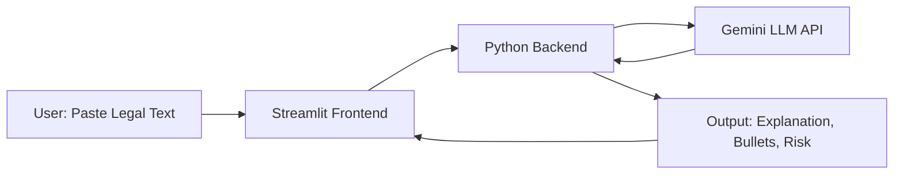

# Legal Lens: AI-Powered Legal Document Demystifier


Link: https://ai-exchange-hackathon-ai-legal-lens-fshc5tctfkabujrcuenbnx.streamlit.app/

## Problem Statement
Legal documents are hard to read, especially for youth and non-experts. Complex terms, hidden risks, and legal jargon make it tough to understand what you’re agreeing to. This can lead to confusion, missed obligations, or even financial loss.

## Solution
**Legal Lens** is a simple web app that uses Generative AI (Google Gemini) to break down legal text into plain English, highlight risks, and summarize key points. Just paste any legal clause, contract, or policy—get a friendly explanation, a risk badge, and a bullet-point summary.

## Unique Selling Points (USP)
- **Risk Classification:** Instantly see if a clause is Low, Medium, or High risk (color-coded).
- **Youth-Friendly Tone:** Explanations are simple, clear, and jargon-free.
- **Bullet-Point Summary:** Key info at a glance.
- **Fast, Lightweight:** Runs in minutes, no setup hassle.

## Features
- Paste legal text and get:
	- Plain English explanation
	- Bullet-point summary
	- Risk level (Low/Medium/High, color-coded)
- (Optional) Logs all analyses for demo

## How to Run Locally
1. Get your Gemini API key from [Google AI Studio](https://aistudio.google.com/app/apikey).
2. Set your API key in the terminal:
	```bash
	export GEMINI_API_KEY=your-gemini-api-key
	```
3. Install dependencies and run the app:
	```bash
	pip install -r requirements.txt
	streamlit run app.py
	```

## Architecture Diagram



## Estimated Cost
- Minimal: Only OpenAI API usage (pay-as-you-go, a few cents per analysis)

## File Structure
```
app.py            # Main app
legal_utils.py    # AI + risk logic
requirements.txt  # Dependencies
logs.csv          # (Optional) Logs
README.md         # This file
```

## Team
Sushar Hembram - Developer and Tester
Anay Saha - Designer

###### Made for Google GenAI Exchange Hackathon by Team Legal Lens.